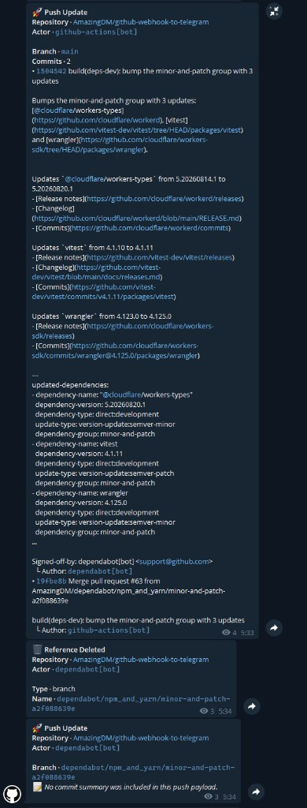
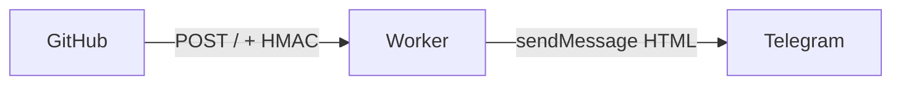

# GitHub Webhook to Telegram

> Forward GitHub repository and organization events to Telegram. Runs on **Cloudflare Workers** — no VPS, no always-on process.

[](LICENSE)
[](https://github.com/AmazingDM/github-webhook-to-telegram/actions/workflows/cloudflare-worker-checks.yml)

> Simplified Chinese: [README.zh-CN.md](README.zh-CN.md)



The screenshot is a real delivery from this repository: a `push` with commit details, then a `delete` after the Dependabot branch was removed.

The Worker accepts GitHub webhooks on `POST /`, verifies `X-Hub-Signature-256`, routes by repository or organization, and sends an HTML message to Telegram.

Recommended path: **fork this repository**, add four GitHub Actions secrets, then deploy with the bundled workflow. You do not need to create the Worker by hand in the Cloudflare dashboard.

## Why this

- **No server to keep running.** Only Cloudflare Workers is used (no KV, D1, R2, or Durable Objects). Typical webhook volume fits the Workers free tier.
- **Fork and deploy.** Fill secrets, then run `Cloudflare Worker Deploy` or push a Git tag.
- **One Worker, many targets.** `HOOK_CONFIG_JSON` maps `owner/repo` or an organization login to different chats and webhook secrets.
- **Signature required.** Requests without a matching HMAC are rejected with `403`.
- **Forks stay current.** The daily `Sync Upstream` workflow fast-forwards `main` when you have no fork-only commits.

**Not this project:** it is not a Telegram bot you chat with, and it does not speak GitLab. Unsupported GitHub events still pass signature checks, then produce no Telegram message.



## Supported events

Labels below match `EVENT_META` in `src/formatters/shared.ts`.

| Event | Telegram title |
| --- | --- |
| `create` | Reference Created |
| `delete` | Reference Deleted |
| `discussion` | Discussion Activity |
| `fork` | Repository Forked |
| `issues` | Issue Activity |
| `ping` | Webhook Ping |
| `public` | Repository Public |
| `pull_request` | Pull Request Activity |
| `push` | Push Update |
| `star` | Stars Updated |

## Deploy

You need a [Telegram bot](https://t.me/BotFather) that can send to the target chat, a Cloudflare account (Account ID + a token that can edit Workers Scripts), and a GitHub repository or organization to watch.

1. Fork this repository and enable Actions on the fork.
2. Add these secrets under `Settings -> Secrets and variables -> Actions`:

| Secret | Purpose |
| --- | --- |
| `CLOUDFLARE_API_TOKEN` | Token used by the deploy workflow |
| `CLOUDFLARE_ACCOUNT_ID` | Cloudflare Account ID |
| `BOT_TOKEN` | Telegram bot token |
| `HOOK_CONFIG_JSON` | Routing JSON (must be one line) |

```json
{"gh_webhooks":{"your-name/your-repo":{"chat_id":-1001234567890,"secret":"replace-with-random-secret"}}}
```

`chat_id` may be a numeric ID (`-1001234567890`) or a public channel username (`@channel_name`). To rename the Worker, edit `name` in [wrangler.toml](wrangler.toml) (default: `github-webhook-to-telegram`).

3. Deploy, then point GitHub at the Worker:

- Manual: `Actions -> Cloudflare Worker Deploy -> Run workflow`
- Tag: `git tag v1.0.0 && git push origin v1.0.0`

```text
Payload URL: https://<worker-name>.<your-subdomain>.workers.dev/
Content type: application/json
Secret: must match the selected secret in HOOK_CONFIG_JSON
Events: Send me everything
Active: checked
```

Start with **Send me everything**. After a delivery succeeds, you can narrow the event list. Full walkthrough: [docs/deployment.md](docs/deployment.md).

## Configuration

Matching order (first hit wins): `organization.login`, then `repository.full_name`. An organization route therefore overrides a repository route.

```json
{
  "gh_webhooks": {
    "your-name/your-repo": {
      "chat_id": -1001234567890,
      "secret": "repo-secret"
    },
    "your-org": {
      "chat_id": "@your_channel",
      "secret": "org-secret"
    }
  }
}
```

`secret` is the GitHub webhook secret, not `BOT_TOKEN`. A mismatch returns `403`. See [docs/usage.md](docs/usage.md).

## Local development

Local work is optional for the fork deploy path. Requires **Node.js 24+** and **pnpm 10**.

```bash
pnpm install
pnpm typecheck
pnpm test
pnpm build
```

```bash
cp .dev.vars.example .dev.vars
pnpm dev
```

The Worker only accepts `POST /`. Other paths return `404`; other methods return `405`. Do not commit `.dev.vars`.

## Documentation

- [Deployment Overview](docs/deployment.md) — fork to production
- [GitHub Actions Deployment](docs/deployment-actions.md) — secrets, manual and tag releases
- [Worker Configuration](docs/deployment-worker-auto.md) — Cloudflare, Wrangler, troubleshooting
- [Usage Guide](docs/usage.md) — Telegram, `HOOK_CONFIG_JSON`, verification
- [Changelog](docs/changelog.md)

Forks: `Sync Upstream` runs daily. If your `main` has diverged, the workflow stops instead of overwriting; merge upstream, then rerun.

## License

AGPL-3.0-or-later. See [LICENSE](LICENSE). Bugs and questions: [Issues](https://github.com/AmazingDM/github-webhook-to-telegram/issues).
