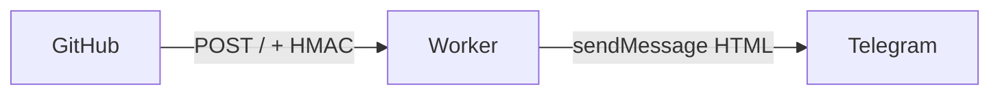

# GitHub Webhook 转发到 Telegram

> 把 GitHub 仓库或组织的事件推到 Telegram。跑在 **Cloudflare Workers** 上，不用买 VPS，也不用常驻进程。

[](LICENSE)
[](https://github.com/AmazingDM/github-webhook-to-telegram/actions/workflows/cloudflare-worker-checks.yml)

> English: [README.md](README.md)


这是本仓库的真实投递：一条带 commit 详情的 `push`，以及 Dependabot 分支被删后的 `delete`。

Worker 只接收 `POST /` 的 GitHub Webhook，校验 `X-Hub-Signature-256`，按仓库或组织路由，再发一条 HTML 消息到 Telegram。

推荐用法：**fork 本仓库**，填 4 个 GitHub Actions Secrets，用自带 workflow 部署。不必在 Cloudflare 控制台里手工建 Worker。

## 为什么用这个

- **不用自己养服务器。** 只用到 Cloudflare Workers（没有 KV、D1、R2、Durable Objects）。普通 Webhook 量一般落在 Workers 免费额度内。
- **Fork 就能部署。** 填好 Secrets，运行 `Cloudflare Worker Deploy` 或推一个 Git tag。
- **一个 Worker，多路转发。** `HOOK_CONFIG_JSON` 把 `owner/repo` 或组织名映射到不同聊天和 Webhook Secret。
- **必须过签名。** HMAC 对不上会返回 `403`。
- **Fork 能跟上游。** 每天的 `Sync Upstream` 会在你没有 fork 独有提交时快进 `main`。

**这不是：** 一个能对话的 Telegram 机器人，也不支持 GitLab。GitHub 上未实现的事件仍会过签名校验，但不会往 Telegram 发消息。



## 支持的事件

标题与 `src/formatters/shared.ts` 里的 `EVENT_META` 一致。

| 事件 | Telegram 标题 |
| --- | --- |
| `create` | Reference Created |
| `delete` | Reference Deleted |
| `discussion` | Discussion Activity |
| `fork` | Repository Forked |
| `issues` | Issue Activity |
| `ping` | Webhook Ping |
| `public` | Repository Public |
| `pull_request` | Pull Request Activity |
| `push` | Push Update |
| `star` | Stars Updated |

## 部署

你需要：能向目标聊天发消息的 [Telegram Bot](https://t.me/BotFather)、Cloudflare 账号（Account ID + 能编辑 Workers Scripts 的 Token），以及要监听的 GitHub 仓库或组织。

1. Fork 本仓库，并在 fork 上启用 Actions。
2. 在 `Settings -> Secrets and variables -> Actions` 添加：

| Secret | 用途 |
| --- | --- |
| `CLOUDFLARE_API_TOKEN` | 部署 workflow 使用的 Token |
| `CLOUDFLARE_ACCOUNT_ID` | Cloudflare Account ID |
| `BOT_TOKEN` | Telegram Bot Token |
| `HOOK_CONFIG_JSON` | 路由 JSON（必须是一行） |

```json
{"gh_webhooks":{"your-name/your-repo":{"chat_id":-1001234567890,"secret":"replace-with-random-secret"}}}
```

`chat_id` 可以是数字 ID（`-1001234567890`）或公开频道用户名（`@channel_name`）。要改 Worker 名称，编辑 [wrangler.toml](wrangler.toml) 的 `name`（默认：`github-webhook-to-telegram`）。

3. 部署，然后把 GitHub Webhook 指到 Worker：

- 手动：`Actions -> Cloudflare Worker Deploy -> Run workflow`
- Tag：`git tag v1.0.0 && git push origin v1.0.0`

```text
Payload URL: https://<worker-name>.<你的子域>.workers.dev/
Content type: application/json
Secret: 必须等于 HOOK_CONFIG_JSON 里命中的 secret
Events: Send me everything
Active: checked
```

先勾 **Send me everything**，整条链路通了再缩小事件范围。完整步骤见 [docs/deployment.zh-CN.md](docs/deployment.zh-CN.md)。

## 配置

匹配顺序（先命中先用）：`organization.login`，然后 `repository.full_name`。因此组织级路由会覆盖仓库级路由。

```json
{
  "gh_webhooks": {
    "your-name/your-repo": {
      "chat_id": -1001234567890,
      "secret": "repo-secret"
    },
    "your-org": {
      "chat_id": "@your_channel",
      "secret": "org-secret"
    }
  }
}
```

`secret` 是 GitHub Webhook Secret，不是 `BOT_TOKEN`。对不上会返回 `403`。详见 [docs/usage.zh-CN.md](docs/usage.zh-CN.md)。

## 本地开发

走 fork 部署时，本地开发不是必需项。需要 **Node.js 24+** 和 **pnpm 10**。

```bash
pnpm install
pnpm typecheck
pnpm test
pnpm build
```

```bash
cp .dev.vars.example .dev.vars
pnpm dev
```

Worker 只接受 `POST /`。其他路径返回 `404`，其他方法返回 `405`。不要提交 `.dev.vars`。

## 文档

- [部署总览](docs/deployment.zh-CN.md) — 从 fork 到上线
- [GitHub Actions 部署](docs/deployment-actions.zh-CN.md) — Secrets、手动发布、tag 发布
- [Worker 配置](docs/deployment-worker-auto.zh-CN.md) — Cloudflare、Wrangler、排障
- [使用教程](docs/usage.zh-CN.md) — Telegram、`HOOK_CONFIG_JSON`、验证
- [更新记录](docs/changelog.zh-CN.md)

Fork：`Sync Upstream` 每天运行。若你的 `main` 已经分叉，workflow 会停住以免覆盖；手动合并上游后再跑一次即可。

## 许可证

AGPL-3.0-or-later，见 [LICENSE](LICENSE)。问题与缺陷请开 [Issues](https://github.com/AmazingDM/github-webhook-to-telegram/issues)。
